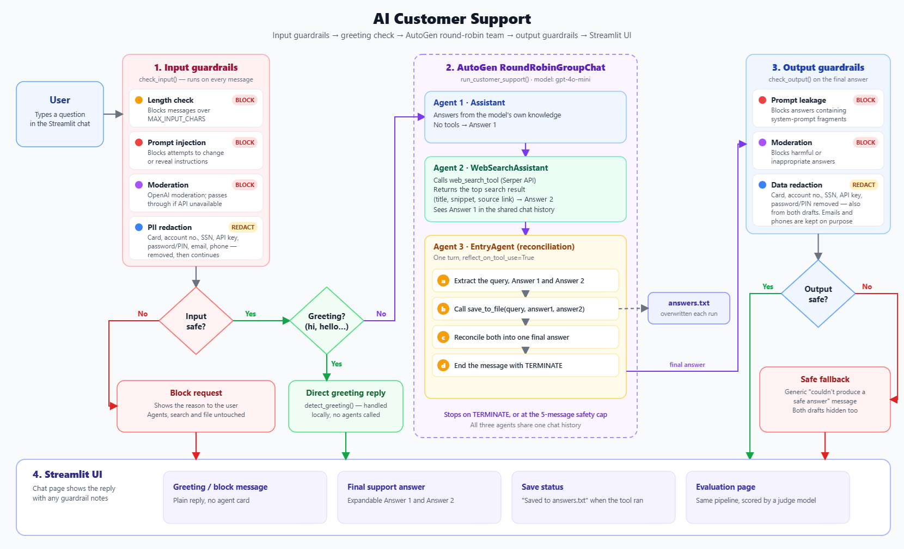

# Multi-Agent-Customer-Support-Autogen

A customer support chatbot built from three agents using Microsoft's AutoGen framework, with a Streamlit user interface. For each question:

1. **Knowledge Assistant** answers from the model's own knowledge.
2. **Web Search Assistant** searches the web (Serper API) and returns the top result (title, snippet and source link).
3. **Reconciliation Entry Agent** saves the question and both answers to `answers.txt`, then merges them into one final answer for the user.

The app also has input/output guardrails and a built-in evaluation page. The application code lives in a single file, `app.py`.

**Live demo:** https://supportdude.sbs

## Flow



## Project files

| File | Purpose |
|---|---|
| `app.py` | The whole application: UI, agents, guardrails and evaluation |
| `requirements.txt` | Python dependencies |
| `.env.example` | Template for API keys and settings |
| `.streamlit/config.toml` | Light theme and accent colour for the UI |
| `docs/architecture.png` | Flow diagram shown above |
| `Dockerfile`, `docker-compose.yml`, `docker-compose.vps.yml`, `Caddyfile`, `.dockerignore` | Deployment (see [Deployment](#deployment-docker--caddy--ssl)) |
| `answers.txt` | Written by the Entry Agent for the latest chat question |
| `eval_answers.txt` | Written during evaluation runs instead of `answers.txt` (git-ignored) |

## Setup

```bash
python -m venv .venv
.venv\Scripts\activate          # Windows
# source .venv/bin/activate     # macOS / Linux
pip install -r requirements.txt
```

Copy `.env.example` to `.env` and fill it in:

| Variable | Required | Purpose |
|---|---|---|
| `OPENAI_API_KEY` | Yes | Agents, moderation and the evaluation judge |
| `SERPER_API_KEY` | Yes | Web search |
| `ENABLE_EVALUATION` | No | `true` enables the Run evaluation button (default: off) |
| `DOMAIN` | Docker only | Domain Caddy serves and gets the SSL certificate for |
| `ACME_EMAIL` | Docker only | Email for the certificate account (expiry notices) |

The app stops with an error message if either API key is missing.

## Run

```bash
streamlit run app.py
```

The sidebar has a **💬 Chat / 📊 Evaluation** switch.

## How the agents work

- The agents run in a `RoundRobinGroupChat` using `gpt-4o-mini` (`DEFAULT_MODEL` in `app.py`).
- The Web Search Assistant calls `web_search_tool`, which returns the top Serper result (title, snippet and source link).
- The Entry Agent calls `save_to_file(query, answer1, answer2)`. It then writes the final answer in the same turn (`reflect_on_tool_use=True`) and ends with `TERMINATE`.
- The run stops when `TERMINATE` appears, or after 5 chat messages as a safety net. A normal run is 4 messages: the user question plus one message from each agent.

## Chat features

- **Greetings and small talk** get an instant reply without starting the agents. This covers "hi", "who are you", "what can you do", "thanks", "bye" and similar.
- **Vague inputs** get a request for more detail instead of an agent run. This covers inputs like "what", "ok", "hmm" or "???".
- **Suggested questions** appear on the welcome screen and can be clicked to send.
- **Each answer** appears in a "Final support answer" card, with expanders showing the Knowledge Assistant's answer and the web search findings.
- **Clear conversation** is a button in the sidebar that resets the chat.
- **Short windows:** Streamlit opens chat pages scrolled to the bottom. The welcome screen gets more compact on windows under 900px and 720px tall, so the header isn't pushed out of view.

## Guardrails

### Input (before the question reaches the agents)

- **Length limit:** messages over 2,000 characters are rejected.
- **Prompt injection:** pattern checks refuse messages like "ignore previous instructions", "reveal your system prompt" or "developer mode".
- **Harmful content:** checked with OpenAI's moderation endpoint (`omni-moderation-latest`).
- **Personal data redaction:**
  - Account numbers are detected by nearby words such as "account no", "a/c" or "acct".
  - Card numbers are redacted only when they pass the Luhn checksum, so order and tracking numbers are left alone.
  - SSNs, API keys, passwords, PINs, OTPs, CVVs, email addresses and phone numbers are also redacted. Phone numbers must contain separators to be detected.
  - The redacted text is what gets shown, stored, sent to the agents and web search, and saved to `answers.txt`. The user sees a 🛡️ note explaining what was removed.

### Output (before the answer is shown)

- **Leaked instructions:** answers that repeat the agents' system instructions are blocked.
- **Harmful content:** the final answer goes through the same moderation check.
- **Sensitive data:** account numbers, card numbers, SSNs, API keys and passwords/PINs are removed from the final answer and from both agent drafts. Emails and phone numbers are kept because support answers often contain contact details.

If the moderation API is unavailable, messages are allowed through (fail open) so the chat keeps working.

## Evaluation

The **📊 Evaluation** page runs test questions through the same path as the chat: input guardrail, then the three agents, then the output guardrail.

**Running evaluations is off by default,** because each run spends real API credits. When it's off, the button is disabled and an "I'm broke" message explains why. To run evaluations locally, add `ENABLE_EVALUATION=true` to your `.env`. Keep it unset or `false` on public deployments.

- **Test set:** 10 built-in questions (`EVAL_DATASET` in `app.py`), each with 4 expected key points.
- **Options:** how many questions to run, the agent model, and the judge model (default `gpt-4o`).
- **Judge:** an LLM judge grades retrieval and answers.
- **Live calls:** every run makes real OpenAI and Serper calls.

It reports four areas:

| Area | What's measured |
|---|---|
| **Retrieval quality** | How often the search runs and how often it fails. Judge scores (1–5) for how well the search query matches the question, how relevant the result is, and how trustworthy the source is. Context recall is the share of expected key points the search result supports. |
| **Answer quality (Entry Agent)** | Pass rate. Judge scores (1–5) for correctness, faithfulness, how well it merged the two inputs, and clarity. Key-point recall compared with the Knowledge Assistant alone. Whether it saved before answering, whether it ended with `TERMINATE`, and how often the output guardrail blocked it. |
| **Cost** | Tokens per agent (from AutoGen usage records), cost per question and per 1,000 questions, and the split between LLM and search cost. The judge's cost is shown separately. |
| **Latency** | Median (p50), 95th-percentile (p95) and slowest end-to-end time. Average time per stage (guardrails and each agent), and time spent waiting on the Serper API. |

Per-question results can be downloaded as CSV or JSON.

**Cost figures are estimates.** They use the prices in `MODEL_PRICES` (USD per 1M tokens) and `SEARCH_PRICE` (USD per search, default $0.001) in `app.py`. Update them to match your OpenAI and Serper pricing.

## Deployment (Docker + Caddy + SSL)

The app runs in Docker on a VPS. [Caddy](https://caddyserver.com) sits in front as a reverse proxy. It serves your domain, gets a free SSL certificate (from Let's Encrypt, or ZeroSSL as a fallback), renews it automatically, and redirects HTTP to HTTPS.

| File | Purpose |
|---|---|
| `Dockerfile` | Builds the Streamlit app image (Python 3.13, non-root user, health check). Also sets the page title and link-preview tags; see [Link previews](#link-previews). |
| `docker-compose.yml` | Runs the app container plus the Caddy container on ports 80/443 |
| `docker-compose.vps.yml` | Alternative for a VPS that already runs another Caddy on 80/443: starts only the app and joins that Caddy's Docker network (set `PROXY_NETWORK`) |
| `Caddyfile` | Domain, SSL and reverse-proxy settings |
| `.dockerignore` | Keeps `.env`, `.venv` and local files out of the image |

### Test locally first

With Docker Desktop running, set these in `.env`:

```
DOMAIN=localhost
ACME_EMAIL=test@example.com
```

Then:

```bash
docker compose up -d --build
docker compose ps        # app should become "healthy", caddy "Up"
```

Open https://localhost. The browser warns about the certificate, because Caddy uses its own local certificate for `localhost`. Stop with `docker compose down`.

### 1. Point the domain at the VPS

In your domain's DNS settings (for Hostinger: hPanel → Domains → Manage → DNS / Nameservers):

| Type | Name | Points to |
|---|---|---|
| A | `@` | your VPS public IPv4 (`curl -4 ifconfig.me` on the VPS) |
| CNAME | `www` | your domain |

Wait until `getent hosts your-domain` on the VPS returns the VPS IP. Caddy can't get a certificate until DNS resolves. A newly registered domain can take from a few minutes to a few hours to become visible, even when the registrar already shows it as Active.

Several domains can point to the same VPS IP. Caddy tells them apart by name, so you don't need to change another domain's records.

### 2. Prepare the VPS (Ubuntu)

```bash
# Install Docker (skip if you chose Hostinger's Docker VPS template)
curl -fsSL https://get.docker.com | sh

# Open SSH, HTTP and HTTPS
ufw allow 22 && ufw allow 80 && ufw allow 443 && ufw enable
```

If a firewall is also enabled in Hostinger's VPS panel, allow ports 80 and 443 there too.

### 3. Copy the project and configure it

```bash
cd /opt/apps
git clone https://github.com/rxbass/Multi-Agent-Customer-Support-Autogen.git
cd Multi-Agent-Customer-Support-Autogen

cp .env.example .env
nano .env   # set OPENAI_API_KEY, SERPER_API_KEY, DOMAIN, ACME_EMAIL
            # leave ENABLE_EVALUATION=false on a public server
```

### 4. Start

If another container already uses ports 80/443, either stop it first or use `docker-compose.vps.yml` to share its Caddy.

```bash
docker compose up -d --build
docker compose logs -f caddy   # wait for "certificate obtained successfully"
```

Then open `https://your-domain`.

Only the `DOMAIN` name is served. `www.your-domain` resolves through the CNAME but has no site block in `Caddyfile`. To redirect it to the main domain, add this to `Caddyfile`:

```
www.{$DOMAIN} {
	redir https://{$DOMAIN}{uri} permanent
}
```

### Updating

```bash
cd /opt/apps/Multi-Agent-Customer-Support-Autogen
git pull && docker compose up -d --build
```

### Protecting your API credits

The Evaluation page is disabled unless `ENABLE_EVALUATION=true`, but the chat is public and every real question spends OpenAI and Serper credits. To require a password for the whole site:

1. Run `docker compose exec caddy caddy hash-password`.
2. Paste the hash into the commented `basic_auth` block in `Caddyfile`.
3. Run `docker compose restart caddy`.

### Link previews

WhatsApp, Slack, LinkedIn and search engines read the raw HTML without running JavaScript. They would see Streamlit's built-in `<title>Streamlit</title>`, not the `page_title` set in `app.py`.

The `Dockerfile` therefore patches Streamlit's `index.html` during the build, setting the title to "AI Customer Support" and adding a description and `og:` / `twitter:` preview tags. Edit the title and description in the `Dockerfile` to change them. The build fails if Streamlit's markup ever changes, so the fix can't silently disappear.

WhatsApp caches previews. A link shared before the change keeps the old card; share it in a new chat or add a query string such as `?v=2` to see the new one.

### Troubleshooting

| Symptom | Cause / fix |
|---|---|
| `ERR_CONNECTION_TIMED_OUT` | Containers aren't running (`docker compose ps`), or ports 80/443 are blocked by `ufw` or Hostinger's panel firewall. |
| `ERR_SSL_PROTOCOL_ERROR` right after starting | Caddy is still getting the certificate. Wait about 30 seconds and open the site in a new tab. Chrome caches the error. |
| Caddy can't get a certificate | DNS doesn't point at the VPS yet. Check with `getent hosts your-domain`. Don't restart repeatedly: certificate providers rate-limit failed attempts. |
| `docker compose up` fails on port 80/443 | Another container, such as a second Caddy, already uses them. Stop it or use `docker-compose.vps.yml`. |
| `docker build` fails with "requires 1 argument" | Missing the build context. Use `docker build -t support-app .` (note the final dot). |

## Known limitations

- **Pattern-based checks:** injection and personal-data detection use regex patterns, so they can be worded around and may miss formats they don't know. An account number written without words like "account no" is not detected as an account number.
- **Exact-match small talk:** greetings and vague inputs are matched exactly, so longer messages always go to the agents.
- **One search result:** web search uses only the top result.
- **Judge variation:** LLM-judge scores vary between runs, so compare full runs rather than single questions.
- **Latest question only:** `answers.txt` is overwritten on every question, so it holds only the most recent one. Inside Docker it lives in the container and is lost when the container is rebuilt.
- **No link-preview image:** the preview card has a title and description but no image.
